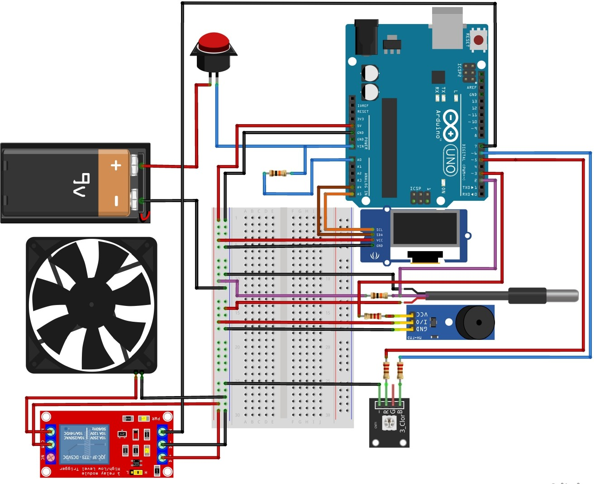
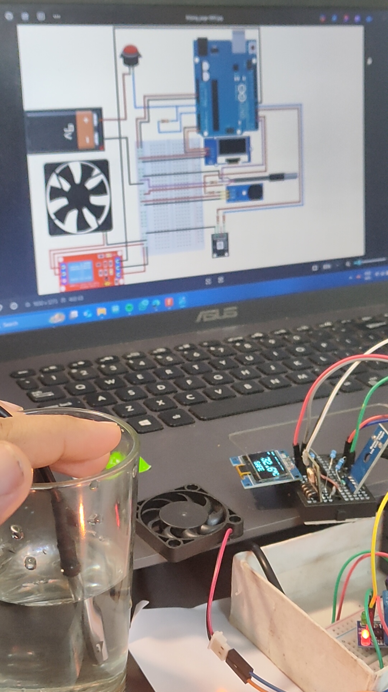
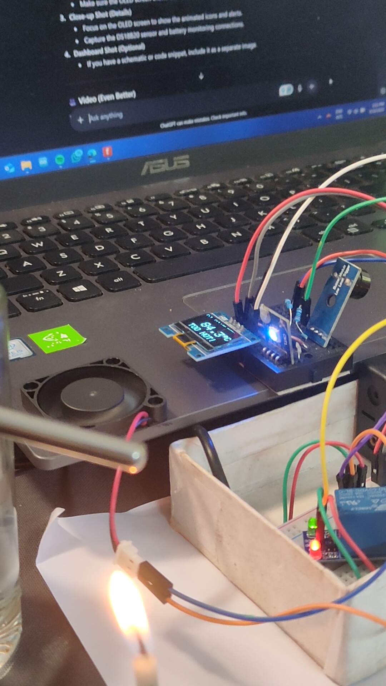

# Arduino Smart Climate Controller

A standalone, battery-powered climate controller built with an Arduino. This device monitors ambient temperature, automatically activates a cooling fan, and triggers a visual/audible alarm for extreme temperature conditions. It also monitors its own battery level and displays all information on a dynamic OLED dashboard.

## 🚀 Core Features
* **Automatic Cooling:** Activates a 5V fan via a relay when the temperature exceeds a set threshold.
* **Custom Alarm:** Features a unique, ambulance-style alarm with a two-tone siren and flashing RGB lights for high or low temperatures.
* **Battery Monitoring:** A voltage divider circuit monitors the 9V battery and displays a warning on the screen when it's time for a replacement.
* **Interactive Dashboard:** A dynamic SSD1306 OLED display shows real-time data with an animated fan icon, a multi-stage battery icon, and blinking status alerts.

## 🛠️ Hardware Components
* Arduino Uno/Nano
* DS18B20 Temperature Sensor
* SSD1306 OLED Display (128x64)
* 5V Single Channel Relay Module
* 5V DC Fan
* Common Cathode RGB LED Module
* Piezo Buzzer
* 9V Battery & Connector
* Resistors: 2x 10kΩ (for battery monitor), 2x 220Ω (for RGB LED), 1x 4.7kΩ (for DS18B20)

## 🔌 Circuit Diagram
Here is the complete wiring diagram for the project, created with Fritzing.

## ⚙️ How to Use
1.  **Libraries:** Install the required libraries in the Arduino IDE: `OneWire`, `DallasTemperature`, `Adafruit GFX`, and `Adafruit SSD1306`.
2.  **Upload:** Upload the `Siren_Temp_Auto_Fan_Voltage.ino` sketch to your Arduino.
3.  **Power On:** The device will start up and begin monitoring the environment.

## 📷 Project Images

